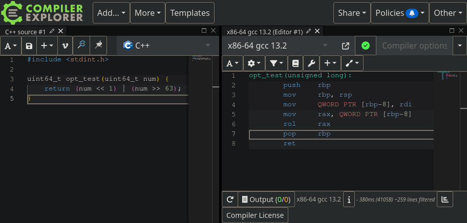
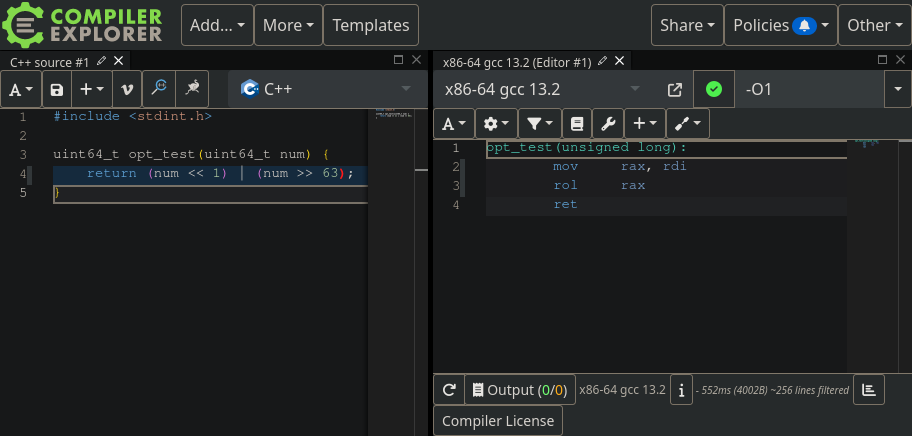
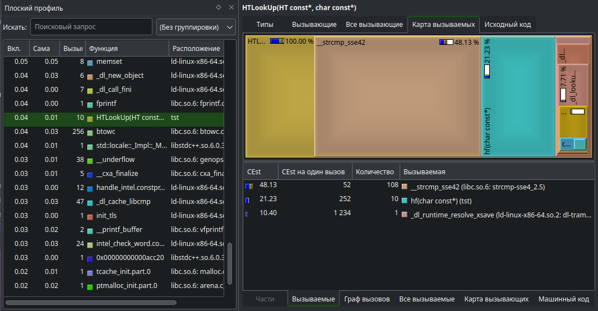
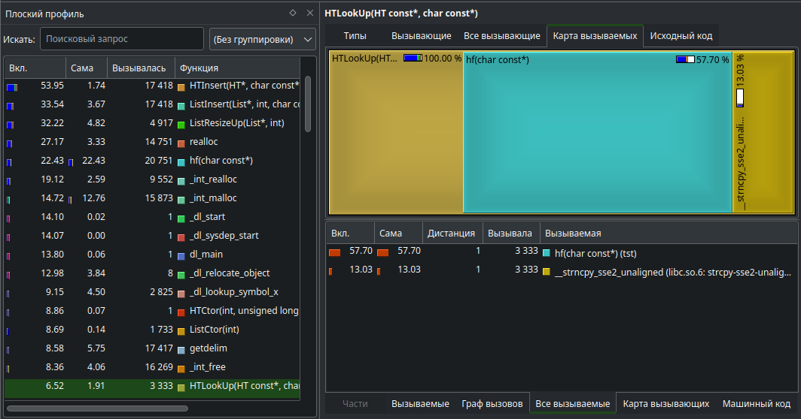
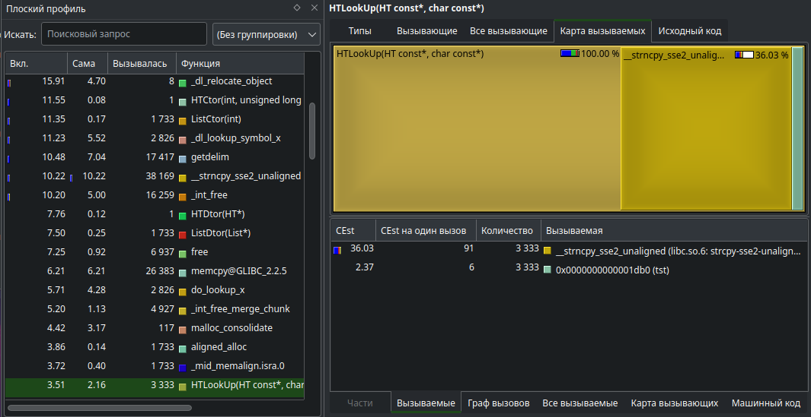
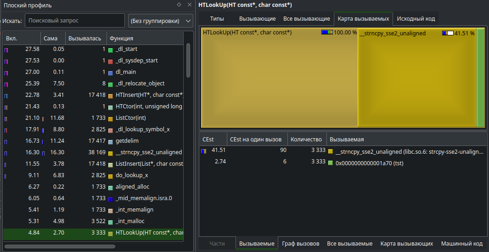
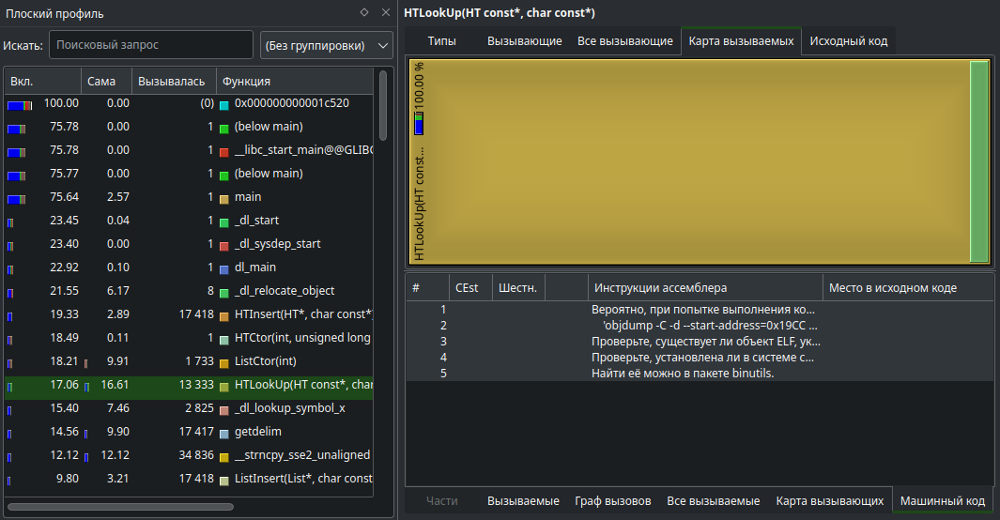

# Тестирование хэш-таблицы

Изначально хэш-таблица хранит строки, состоит из списков из предыдущей работы, хэш-функция предоставляется при создании.

## 1 часть
Проверка качества хэш-функций:
1. Создаём список слов (`process-words.py` из `War and Peace.txt.xz`), их 17415
2. Вставляем их в хэш-таблицу, размер которой в 10 раз меньше слов и является простым числом
3. На столбчатой диаграмме смотрим равномерность заполнения, считаем дисперсию - численый коэффициент "хорошести" хэш-функции

### Результаты
1. Константа - выдаёт одно и то же значение, хуже всех 
2. Первый символ строки 
3. Длина строки 
4. Сумма символов строки 
5. На каждом символе делает вращение битов хэша вправо, xor с значением символа 
6. То же, что 5, только вращение влево 
7. Мой хэш, случайно набросанные команды, победил, хотя я его некорректировал
```c
// Моя хэш-функция
uint64_t hf(const char* s) {
        uint64_t h = 0;
        char last = 'x';

        for (char* c = (char*) s; *c; c++) {
                h = h << 3;
                h = h + *c;
                h = h ^ (h >> (32 + (*c % 4)));
                h = h ^ ((*c * last) << (last % 42));
                last = *c;
        }

        return h;
}

```

8. CRC32, команда ассемблера, перекочевала из второй части, побеждает мою в скорости 


### Дополнительно
1. Проверка оптимизации бинарного вращения в [Compiler Explorer](https://godbolt.org/):



3. Проверка коварности хэш-функции - суммы символов (в сравнении с CRC32), при небольшом размере таблицы - работает нормально, а при большом - нет:


## 2 часть
Оптимизируем скорость LookUp в хэш-таблице тремя способами:
1. Inline-assembly
2. Intrinsics
3. Отдельный файл с assembly

### История
Перед тем, как начать оптимизировать, создаём два версии: `baseline0` - без любых оптимизаций, `baseline1` - с оптимизациями компилятора и без валидаторов.

До оптимизаций:


_Файл: `callgrind.out.1001`_

1. `opt1`:

_Файл: `callgrind.out.1002`_

_Замечание_: Когда я проходился по оптимизациям в первый раз, то запускал `HTLookUp` небольшое количество раз, поэтому если прогнать старые версии заново, то самые долгие функции могут поменяться.

Здесь видно, что большое время занимает `strcmp`. Его можно заменить AVX, благо все нужные слова помещаются в 32 байта.

Для этого `strlist` теперь использует массивы 256 бит вместо указателей на строки и `strcmp` заменён на `_mm256_xor_pd` + `_mm256_testz_si256`.

3. `opt2`:

_Файл: `callgrind.out.1003`_

Теперь самая долгая - это моя хэш-функция. Её можно заменить SSE инструкцией `crc32`, которую вынесем в отдельный asm файл.

5. `opt2.1`:

_Файл: `callgrind.out.1004`_

В `strlist` новые записи добавлялись "справа-налево", а при расширении снова уноситься вправо, что плохо для локальности.

Чтобы это исправить проще избавиться от списка и сделать массив, где элементы будут добавляться по-порядку.


7. `opt3`:


Теперь единственной функцией стала `strncpy`. Я не хотел трогать цикл, так как он был полон интринсиков. Поэтому я заменил `strncpy` inline-assembly. Получилось, что это эта версия иногда выигрывает предыдущей, а иногда проигрывает.

### Результат
| **Версия** | **Время** (rdtsc) | **Ускорение** |
| ----------:|:-----------------:|:-------------:|
| baseline0  | 346993751.7       | -6561.54%     |
| baseline1  | 5208909.7         | +0%           |
| opt1       | 4479778.0         | +14%          |
| opt2       | 4101874.8         | +21.25%       |
| opt2.1     | 2877568.4         | +44.76%       |
| opt3       | 3003846.1         | +42.33%       |

Данные получены запуском скрипта `make`

